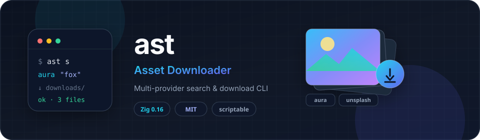

<div align="center">

[](#readme)

[](#installation)
[](https://ziglang.org)
[](LICENSE)
[](https://github.com/gitadityakumar/assets-downloader/actions/workflows/ci.yml)
[](https://github.com/gitadityakumar/assets-downloader/releases)
[](#installation)

</div>

**ast** (Asset Downloader) is a feature-focused command-line tool for searching and downloading public image assets from multiple providers. It is written in [Zig](https://ziglang.org) 0.16, ships as a single native binary, and is designed for both interactive use and scripting.

* [INSTALLATION](#installation)
    * [Quick install (Linux)](#quick-install-linux)
    * [Pre-built binaries](#pre-built-binaries)
    * [Build from source](#build-from-source)
    * [Install to a prefix](#install-to-a-prefix)
    * [Dependencies](#dependencies)
* [RELEASING](#releasing)
* [USAGE AND OPTIONS](#usage-and-options)
    * [Synopsis](#synopsis)
    * [Examples](#examples)
    * [Options](#options)
    * [Exit status](#exit-status)
* [PROVIDERS](#providers)
    * [Supported providers](#supported-providers)
    * [Adding a provider](#adding-a-provider)
* [INTERACTIVE MODE](#interactive-mode)
* [PROJECT LAYOUT](#project-layout)
* [CONTRIBUTING](#contributing)
* [DISCLAIMER](#disclaimer)
* [LICENSE](#license)

# INSTALLATION

## Quick install (Linux)

Download and install the latest pre-built binary with one command:

```bash
curl -fsSL https://raw.githubusercontent.com/gitadityakumar/assets-downloader/main/install.sh | bash
```

This detects your CPU architecture, downloads a **static musl** build when available, verifies the SHA-256 checksum, and installs `ast` to `~/.local/bin` (create that directory and ensure it is on your `PATH` if needed).

| Variable | Default | Description |
|----------|---------|-------------|
| `VERSION` | latest GitHub release | Version without a leading `v` (e.g. `1.0.0`) |
| `PREFIX` / `BINDIR` | `~/.local/bin` | Install directory |
| `TARGET` | auto | Force a Zig target triple (e.g. `x86_64-linux-gnu`) |
| `VERIFY` | `1` | Set to `0` to skip checksum verification |
| `REPO` | `gitadityakumar/assets-downloader` | GitHub repository |

Examples:

```bash
# Pin a version
curl -fsSL https://raw.githubusercontent.com/gitadityakumar/assets-downloader/main/install.sh | VERSION=1.0.0 bash

# System-wide install (may prompt for sudo)
curl -fsSL https://raw.githubusercontent.com/gitadityakumar/assets-downloader/main/install.sh | PREFIX=/usr/local/bin bash

# Prefer a glibc-linked binary
curl -fsSL https://raw.githubusercontent.com/gitadityakumar/assets-downloader/main/install.sh | TARGET=x86_64-linux-gnu bash
```

macOS and Windows users should [build from source](#build-from-source) for now; CI publishes Linux binaries only.

## Pre-built binaries

GitHub Releases publish archives and bare binaries for these Linux targets:

| Target | Notes |
|--------|--------|
| `x86_64-linux-musl` | Static; default install on Intel/AMD 64-bit |
| `aarch64-linux-musl` | Static; default install on ARM64 |
| `x86_64-linux-gnu` | Dynamically linked against glibc |
| `aarch64-linux-gnu` | Dynamically linked against glibc |
| `arm-linux-musleabihf` | Static 32-bit ARM (hard-float) |
| `riscv64-linux-musl` | Static RISC-V 64-bit |

Asset names look like `ast-<target>-<version>.tar.gz` (and a matching bare binary). Each release also ships `SHA256SUMS` and a copy of `install.sh`.

Browse releases: https://github.com/gitadityakumar/assets-downloader/releases

## Build from source

**Requirements:** [Zig](https://ziglang.org/download/) **0.16.0** or newer.

```bash
git clone https://github.com/gitadityakumar/assets-downloader.git
cd assets-downloader
zig build                        # debug → zig-out/bin/ast
zig build -Doptimize=ReleaseFast # optimized release build
zig build test                   # unit tests
```

Cross-compile for a Linux release target (same flags CI uses):

```bash
zig build -Doptimize=ReleaseFast -Dtarget=x86_64-linux-musl
zig build -Doptimize=ReleaseFast -Dtarget=aarch64-linux-musl
```

Run without installing:

```bash
zig build run -- s aura "cyberpunk fox"
# or
./zig-out/bin/ast s aura "cyberpunk fox"
```

## Install to a prefix

```bash
zig build -Doptimize=ReleaseFast --prefix ~/.local
# → ~/.local/bin/ast
```

Ensure `~/.local/bin` is on your `PATH`.

## Dependencies

**ast** has no runtime package dependencies. Networking and TLS use the Zig standard library (`std.http.Client`).

| Dependency | Required | Notes |
|------------|----------|--------|
| Zig ≥ 0.16.0 | Yes (build time) | Compiler and standard library |
| Network access | Yes (runtime) | Provider search and downloads |

# USAGE AND OPTIONS

## Synopsis

```text
ast                              # interactive mode
ast s <provider> <query> [OPTIONS]
ast -s <provider> <query> [OPTIONS]
ast help
ast version
```

Tip: use `CTRL`+`F` (or `Command`+`F`) to search this page.

## Examples

```bash
# Interactive keyboard UI
ast

# Search Aura.build
ast s aura "cyberpunk fox"
ast -s aura "cyberpunk fox"

# Search Unsplash
ast s unsplash "golden retriever"

# Limit results, machine-readable JSON
ast s aura "cyberpunk fox" -l 5
ast s aura "cyberpunk fox" -j
ast -sjl 3 aura "cat"

# First result only: URL, prompt, or download
ast s aura "cyberpunk fox" -f -u
ast s aura "cyberpunk fox" -f -p
ast s aura "cyberpunk fox" -f -d -o ./downloads
ast -sfu unsplash "mountains"
```

Combined short options are supported (POSIX-style), e.g. `-sjl 3` ≡ `--search --json --limit 3`.

## Options

```text
-h, --help              Print this help text and exit
-v, --version           Print program version and exit

-s, --search            Run search (alternative to subcommand s)
-P, --provider <id>     Provider id (or pass as first positional after s)
-l, --limit <n>         Number of results (default: 10)
-f, --first             Only the highest-ranked result

-j, --json              Machine-readable JSON output
-u, --url               Print image URL only
-p, --prompt            Print generation prompt only (when available)
-d, --download          Download result image(s) to the output directory
-o, --output <dir>      Download directory (default: downloads)

-q, --quiet             Suppress non-essential messages
```

| Mode | Behavior |
|------|----------|
| Default search | Human-readable list on stdout; progress on stderr |
| `--json` | JSON objects (one asset per result) |
| `--url` | Image URL only (one line per result) |
| `--prompt` | Prompt text only when the provider supplies one |
| `--download` | Saves files under `--output` (default `downloads/`) |
| `--first` | Restricts to a single top result (useful with `-u` / `-p` / `-d`) |

Provider and query may be given as positionals after `s` / `-s`, or with `-P` / `--provider` plus the query as remaining positionals.

## Exit status

| Code | Meaning |
|------|---------|
| `0` | Success |
| `1` | Usage / validation error |
| `2` | Network error |
| `3` | Not found |
| `4` | Rate limited |

# PROVIDERS

**ast** uses a small pluggable provider layer. Each provider implements search (and optional download / field accessors) against a public asset source.

## Supported providers

| Id | Name | Description | Notes |
|----|------|-------------|--------|
| `aura` | [Aura.build](https://www.aura.build) | Public design assets via Supabase PostgREST | Tokenized match on title, description, keywords. See [docs/AURA_API.md](docs/AURA_API.md). |
| `unsplash` | [Unsplash](https://unsplash.com) | Public photo search and free library downloads | See [docs/unsplash.md](docs/unsplash.md). Prefer the [official Unsplash API](https://unsplash.com/developers) for production apps. |
| `isorepublic` | [ISO Republic](https://isorepublic.com) | Free high-resolution CC0 stock photos | Direct full-resolution downloads from WordPress media. |
| `picjumbo` | [Picjumbo](https://picjumbo.com) | Free stock photos by Viktor Hanacek | Direct full-resolution photo downloads. |
| `foodiesfeed` | [Foodiesfeed](https://www.foodiesfeed.com) | Free food photography | Direct master resolution downloads from Cloudflare R2 storage. |

List providers at runtime via `ast help` (printed under **PROVIDERS**).

Providers may rate-limit or block automated clients. Respect each service’s terms of use, attribution rules, and rate limits.

## Adding a provider

1. Implement search / download / field accessors in `src/providers/<id>.zig`
2. Register the provider in `src/providers/registry.zig`
3. Wire dispatch in `src/commands/search.zig` and `src/interactive.zig`
4. Document behavior under `docs/` when the integration is non-trivial

Keep the normalized [`Asset`](src/asset.zig) model stable so JSON and download paths stay consistent across providers.

# INTERACTIVE MODE

Launch with no arguments:

```bash
ast
```

Flow:

1. Select a provider from the menu
2. Enter a search query
3. Pick a result by number
4. Download, print prompt, print URL, search again, or quit

Keyboard: number + Enter · **S** search again · **Q** quit.

# PROJECT LAYOUT

```text
src/
  main.zig                 Entry point and command routing
  args.zig                 Flag parsing (combined short options)
  asset.zig                Normalized Asset / SearchResult model
  config.zig               Version, defaults, user-agent
  download.zig             Save response bodies to disk
  http_client.zig          HTTP helpers (cookies, redirects)
  http_util.zig            Shared HTTPS utilities
  interactive.zig          Interactive menus
  stdio.zig                stdout / stderr / line input
  commands/
    help.zig
    search.zig
  providers/
    registry.zig
    aura.zig
    unsplash.zig
    isorepublic.zig
    picjumbo.zig
    foodiesfeed.zig
assets/                    README banner and static assets
docs/                      Provider implementation notes
install.sh                 curl | bash installer (Linux release binaries)
.github/workflows/
  ci.yml                   Build and test on push / PR
  release.yml              Multi-arch Linux binaries on version tags
```

# RELEASING

CI builds and tests on every push and pull request to `main` (see [`.github/workflows/ci.yml`](.github/workflows/ci.yml)).

Tagged releases publish Linux binaries:

1. Bump `version` in `src/config.zig` and `build.zig.zon` (and the README badge if you keep it in sync).
2. Commit the version bump.
3. Create and push an annotated tag:
   ```bash
   git tag -a v1.0.0 -m "ast v1.0.0"
   git push origin v1.0.0
   ```
4. The [Release](.github/workflows/release.yml) workflow cross-compiles for the Linux targets above, attaches archives, bare binaries, `SHA256SUMS`, and `install.sh` to the GitHub Release.

You can also run the release workflow manually from the Actions tab (`workflow_dispatch`) if you need to republish assets for an existing tag.

# CONTRIBUTING

Bug reports, provider ideas, and pull requests are welcome.

1. Fork and clone the repository
2. Create a focused branch
3. Run `zig build` and `zig build test`
4. Open a pull request with a clear description of the change

Prefer small patches that match the existing style in `src/`. For provider work, include a short note in `docs/` when endpoints or auth models are non-obvious.

# DISCLAIMER

**ast** is not affiliated with, endorsed by, or sponsored by Aura.build, Unsplash, or any other third-party service it can reach.

You are responsible for complying with each provider’s terms of service, license, and attribution requirements when searching or downloading assets. Do not use this tool to abuse rate limits, bypass access controls you are not authorized to use, or redistribute content in ways the original license forbids.

# LICENSE

This project is licensed under the [MIT License](LICENSE).
